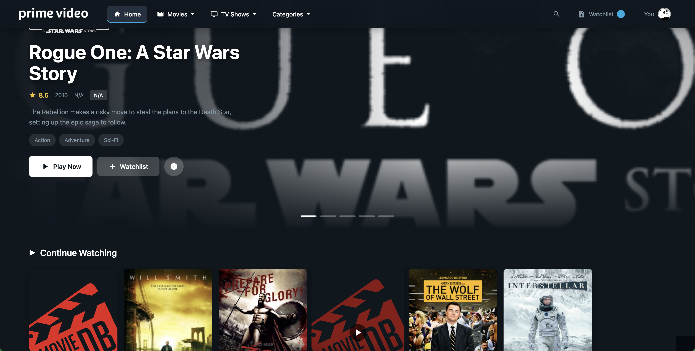
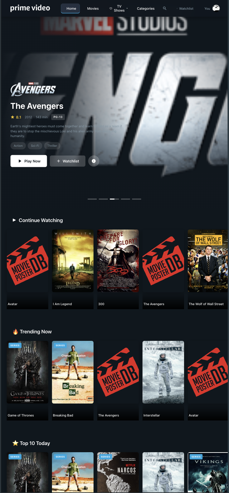
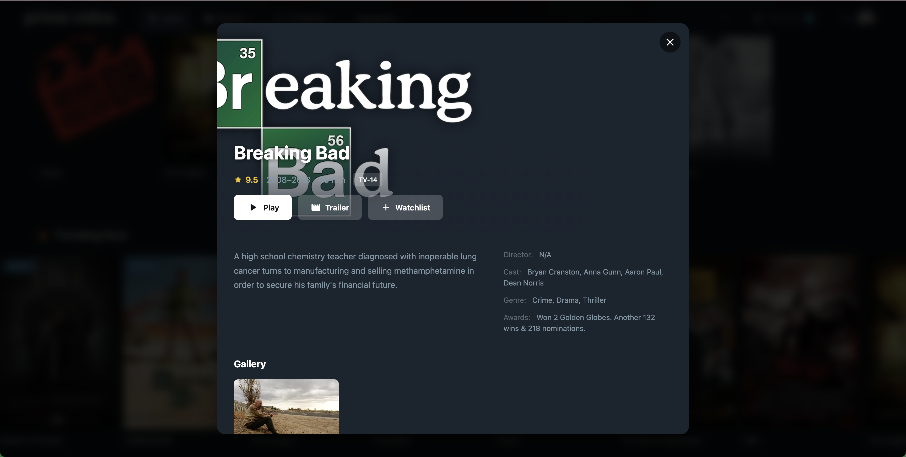
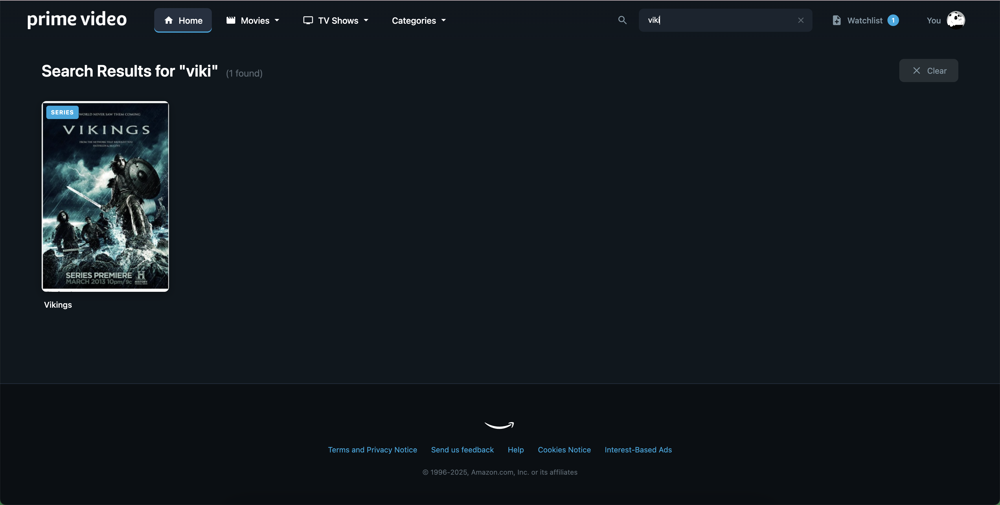
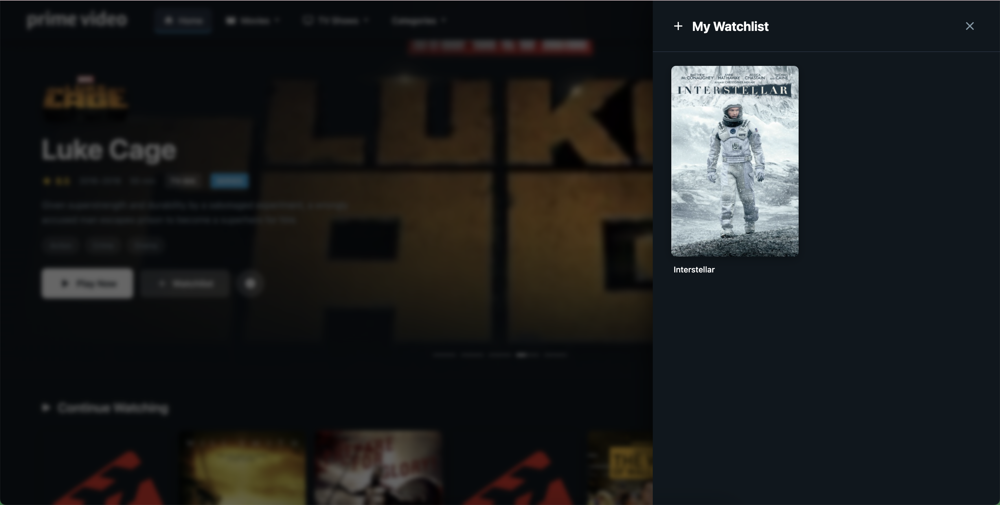

# 🎬 Prime Video Clone

A fully functional, responsive Amazon Prime Video clone built with React.js featuring a modern UI, local data management, and seamless user experience.

  

## 🌟 Live Demo

**🚀 [View Live Demo](https://prime-video-clone-puce.vercel.app/)**

---

## ✨ Features

### 🎯 Core Functionality

- ✅ **Responsive Design** - Works perfectly on desktop, tablet, and mobile devices
- ✅ **Hero Carousel** - Auto-playing hero section with featured content
- ✅ **Content Categories** - Organized by genres, ratings, and types
- ✅ **Real-time Search** - Search across titles, genres, actors, and directors
- ✅ **Watchlist Management** - Add/remove content with localStorage persistence
- ✅ **Movie Details Modal** - View ratings, cast, plot, and more
- ✅ **Browse & Filter** - Filter by type, genre, year, and rating
- ✅ **Content Organization** - Multiple curated categories (Trending, Top Rated, etc.)

### 🎨 User Interface

- Modern Prime Video-inspired design
- Smooth animations and transitions
- Interactive hover effects
- Auto-playing hero carousel with navigation
- Dropdown navigation menus
- Mobile-responsive navigation
- Dark theme optimized for viewing

### ⚡ Technical Implementation

- 100% local data (no API dependencies)
- Enhanced data service with 20+ utility methods
- React Context API for global state
- Performance optimized with React.memo and useMemo
- PWA ready with web manifest
- SEO optimized meta tags
- Accessibility compliant (WCAG)
- Production build: 61.5 kB (gzipped)

---

## 📸 Screenshots

### Desktop View


_Hero carousel with featured content and category sections_

### Mobile View


_Fully responsive design optimized for mobile devices_

### Movie Modal


_Detailed movie information with ratings and cast_

### Search Results


_Real-time search across all content_

### Watchlist


_Personal watchlist with localStorage persistence_

---

## 🛠️ Tech Stack

### Frontend

- **React 18.2.0** - UI library
- **React Context API** - State management
- **React Hooks** - Modern React patterns
- **CSS3** - Styling with custom properties
- **LocalStorage** - Data persistence

### Build Tools

- **Create React App** - Project setup
- **Webpack** - Module bundler
- **Babel** - JavaScript compiler
- **ESLint** - Code linting

### Deployment

- **Vercel** - Hosting and deployment
- **Git** - Version control

---

## 📁 Project Structure

```
Prime-Video-Clone/
├── public/
│   ├── index.html              # HTML template
│   ├── manifest.json           # PWA manifest
│   ├── pv-logo.png            # Favicon
│   └── styles.css             # Global styles
├── src/
│   ├── components/
│   │   ├── App.jsx            # Main app component
│   │   ├── BodyComp.jsx       # Home page body
│   │   ├── BrowsePage.jsx     # Browse/filter page
│   │   ├── CategoryCarousel.jsx    # Content carousel
│   │   ├── ContentTile.jsx    # Content tile (unused)
│   │   ├── EnhancedContentTile.jsx # Enhanced tile
│   │   ├── FooterComp.jsx     # Footer
│   │   ├── HeaderComp.jsx     # Header/navigation
│   │   ├── HeroCarousel.jsx   # Hero section
│   │   ├── MovieModal.jsx     # Movie details modal
│   │   ├── SearchResults.jsx  # Search results
│   │   ├── VideoPlayer.jsx    # Video player
│   │   ├── WatchlistPage.jsx  # Watchlist panel
│   │   ├── Categories.js      # Genre categories
│   │   ├── Languages.js       # Language options
│   │   ├── ContentTileData.js # Sample content data
│   │   └── HomeTileData.js    # Home page data
│   ├── context/
│   │   └── AppContext.jsx     # Global state management
│   ├── data/
│   │   └── contentData.js     # Consolidated content data
│   ├── services/
│   │   └── dataService.js     # Data management service
│   ├── images/                # Image assets
│   └── index.js               # App entry point
├── .gitignore                 # Git ignore rules
├── vercel.json                # Vercel configuration
├── package.json               # Dependencies
└── README.md                  # This file
```

---

## 🚀 Getting Started

### Prerequisites

- **Node.js** (v16 or higher)
- **npm** or **yarn**
- **Git**

### Installation

1. **Clone the repository**

   ```bash
   git clone https://github.com/Vanshika-RJIT/prime-video-clone.git
   cd prime-video-clone
   ```

2. **Install dependencies**

   ```bash
   npm install
   ```

3. **Start the development server**

   ```bash
   npm start
   ```

4. **Open your browser**
   ```
   http://localhost:3000
   ```

### Build for Production

```bash
npm run build
```

This creates an optimized production build in the `build` folder.

---

## 📦 Available Scripts

| Command         | Description                                      |
| --------------- | ------------------------------------------------ |
| `npm start`     | Runs the app in development mode                 |
| `npm test`      | Launches the test runner                         |
| `npm run build` | Builds the app for production                    |
| `npm run eject` | Ejects from Create React App (one-way operation) |

---

## 🌐 Deployment on Vercel

### Method 1: Vercel CLI (Recommended)

1. **Install Vercel CLI**

   ```bash
   npm install -g vercel
   ```

2. **Deploy**

   ```bash
   vercel
   ```

   Follow the prompts:
   - Set up and deploy? **Y**
   - Which scope? **Select your account**
   - Link to existing project? **N**
   - What's your project's name? **prime-video-clone**
   - In which directory is your code located? **./**
   - Want to override settings? **N**

3. **Production Deployment**
   ```bash
   vercel --prod
   ```

### Method 2: GitHub Integration (Easiest)

1. **Push to GitHub**

   ```bash
   git add .
   git commit -m "Deploy Prime Video Clone"
   git push origin main
   ```

2. **Import to Vercel**
   - Go to [Vercel Dashboard](https://vercel.com/new)
   - Click **"Import Project"**
   - Import your GitHub repository
   - Vercel auto-detects Create React App
   - Click **"Deploy"**
   - Done! 🎉

### Method 3: Direct Deployment

1. **Build the project**

   ```bash
   npm run build
   ```

2. **Deploy with Vercel CLI**
   ```bash
   vercel --prod
   ```

### Custom Domain Setup

1. Go to your project in Vercel Dashboard
2. Navigate to **Settings** → **Domains**
3. Add your custom domain
4. Update DNS records as instructed
5. SSL certificate is automatically provisioned

### Environment Variables (Optional)

If you need environment variables:

1. Go to **Settings** → **Environment Variables**
2. Add variables:
   - `REACT_APP_SITE_NAME=Prime Video Clone`
   - `REACT_APP_VERSION=1.0.0`
3. Redeploy for changes to take effect

---

## 🎨 Customization

### Adding New Content

Edit `src/data/contentData.js`:

```javascript
{
  id: 15,
  Title: "Your Movie Title",
  Year: "2024",
  rated: "PG-13",
  Genre: "Action, Thriller",
  Director: "Director Name",
  Actors: "Actor 1, Actor 2",
  Plot: "Movie description...",
  imdbRating: "8.5",
  poster: "https://your-poster-url.jpg",
  Type: "movie",
  images: ["backdrop-url-1.jpg", "backdrop-url-2.jpg"]
}
```

### Modifying Styles

Global styles are in `public/styles.css`. Key CSS variables:

```css
:root {
  --primary-blue: #00a8e1;
  --primary-cyan: #00d4aa;
  --accent-gold: #f5c518;
  --bg-dark: #0f171e;
  --bg-darker: #0a0f14;
}
```

### Changing Theme Colors

Update colors in:

- `public/styles.css` (CSS variables)
- `public/manifest.json` (PWA theme)
- `public/index.html` (meta theme-color)

---

## 📊 Data Service API

The enhanced data service provides powerful methods:

```javascript
import dataService from "./services/dataService";

// Get all content
const allContent = dataService.getAllContent();

// Search
const results = dataService.search("action");

// Filter
const filtered = dataService.filterContent({
  type: "movie",
  genre: "Action",
  minRating: 7.0,
});

// Get top rated
const topRated = dataService.getTopRated(10);

// Get similar content
const similar = dataService.getSimilarContent("tt0499549", 6);
```

### Available Methods

The data service provides powerful utility methods:

- `getAllContent()` - Get all movies and shows
- `getContentById(id)` - Get specific content by ID
- `getMovies()` - Get all movies
- `getSeries()` - Get all TV series
- `getByGenre(genre)` - Filter by genre
- `search(query)` - Search across all fields
- `getTopRated(limit)` - Get top rated content
- `getTrending(limit)` - Get trending content (rating × votes)
- `getAwardWinners()` - Get award-winning content
- `filterContent(filters)` - Multi-criteria filtering
- `getSimilarContent(id, limit)` - Get similar content recommendations

---

## 🎯 Content Categories

The app includes these curated content sections:

- **Continue Watching** - Recently viewed content
- **Trending Now** - Most popular content (based on rating × votes)
- **Top 10 Today** - Highest rated content
- **Popular Movies** - All available movies
- **Binge-worthy TV Series** - All available TV shows
- **Action & Adventure** - Action genre content
- **Drama** - Drama genre content
- **Sci-Fi & Fantasy** - Science fiction and fantasy content
- **Coming Soon** - Upcoming releases
- **Award Winning Content** - Oscar and award-winning titles

---

## 🔍 Search & Filter

### Search Features

- Real-time search as you type
- Searches across multiple fields: titles, genres, actors, directors, plots
- Instant results display
- Clear search functionality
- No results state handling

### Filter Options

- **Type:** Movies or TV Shows
- **Genre:** Action, Drama, Comedy, Sci-Fi, etc.
- **Year:** Filter by release year
- **Rating:** Minimum IMDb rating filter
- **Sort:** By rating, popularity, year, or alphabetically

---

## 🐛 Troubleshooting

### Issue: Page not found on refresh

**Solution:** Already fixed with `vercel.json` configuration for SPA routing

### Issue: Build warnings

**Solution:** All build warnings have been resolved. The build is clean.

### Issue: Images not loading

**Solution:** Check that image URLs in `src/data/contentData.js` are valid and accessible

---

## 🤝 Contributing

Contributions are welcome! Please follow these steps:

1. Fork the repository
2. Create a feature branch (`git checkout -b feature/NewFeature`)
3. Commit your changes (`git commit -m 'Add some NewFeature'`)
4. Push to the branch (`git push origin feature/NewFeature`)
5. Open a Pull Request

---

## 📝 License

This project is licensed under the MIT License - see the [LICENSE](LICENSE) file for details.

---

## 🙏 Acknowledgments

- Design inspired by [Amazon Prime Video](https://www.primevideo.com)
- Movie data structure based on OMDb API format
- Icons from SVG libraries
- Built with Create React App

---

## 🎉 Show Your Support

Give a ⭐️ if you like this project!
